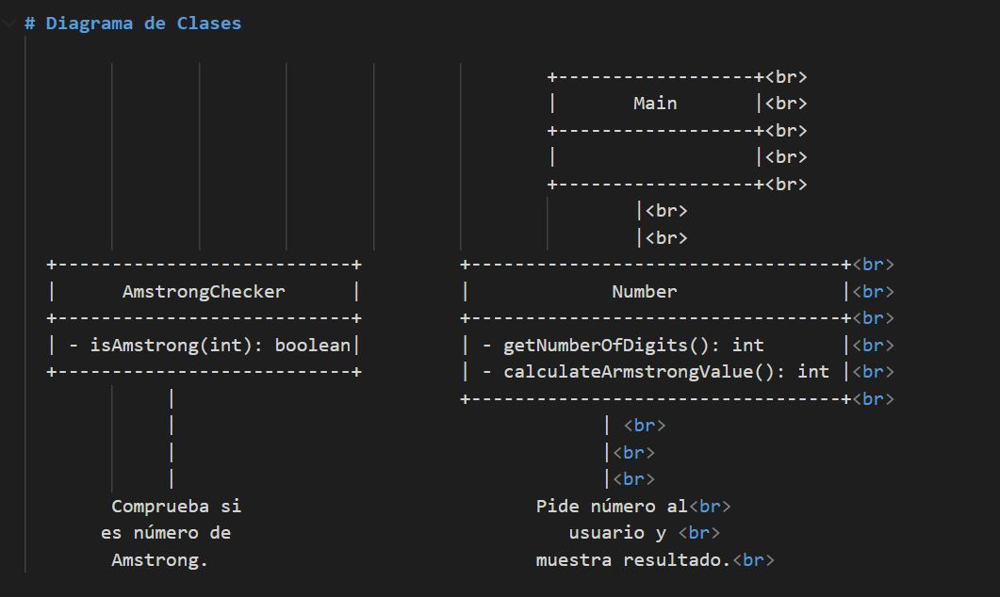

# Java 6th Exercise: Amstrong

Enunciado:
Se quiere desarrollar un programa que determine si un número es un número de Amstrong. Un número de Amstrong es aquel que es igual a la suma de sus dígitos elevados a la potencia de su número de cifras.

Por ejemplo, el número 371 es un número que cumple dicha característica ya que tiene tres cifras y:
371 = 3^3 + 7^3 + 1^3 = 27 + 343 + 1 = 371

# Estructura del Proyecto
Java_6th_Exercise_Amstrong/  
├── src/ 
│    ├── main/ 
│    │   └── java/ 
│    │       └── com/ 
│    │           └── example/ 
│    │               └── amstrong/ 
│    │                   ├── AmstrongChecker.java 
│    │                   └── Main.java 
│    │                   └── models/ 
│    │                       └── Number.java 
│    ├── test/ 
│    │   └── java/ 
│    │       └── com/ 
│    │           └── example/ 
│    │               └── amstrong/ 
│    │                   ├── AmstrongCheckerTest.java 
│    │                   └── models/ 
│    │                       └── NumberTest.java 
│    └── resources/ 
├── .gitignore 
├── pom.xml 
└── README.md 

Entregable:
- Repositorio de git
- Obligatorio realizar los pruebas unitarias

# Texto Enunciado:
[Enunciado Link]https://docs.google.com/document/d/1-6DPcrDmny4UHEaCBlcs7V6kWdMtPRd1_Ke8aYIQCMA/edit